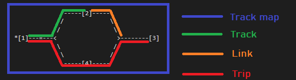
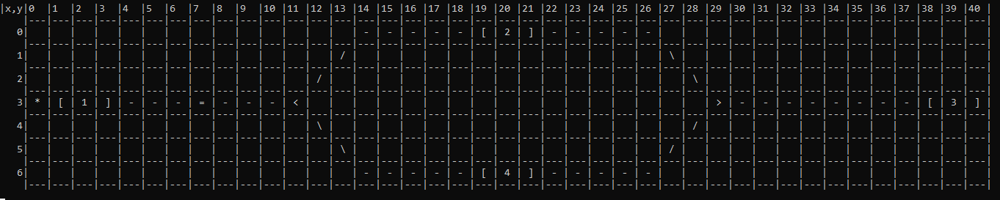

# Documentation
## TrainEngine API
### Main terms and concept

* API can handle track map thats origins from one station and "grows" to east
* Tracks can branch
* Tracks can merge
* API can handle "unlimited" amount of stations, switches, crossings and tracks.
* Tracks contains at least one link. Links starts att station or switch and ends att station or switch.
* One link can be member of several tracks.
### Track ORM
Handels data related to Tracks:
* Takes input data as file or string
```C#
// reads default file
var trackORM = new TrackORMAdv();

// reads specific file
var trackORM = new TrackORMAdv(@"Data\traintrack3.txt");

// reads string as data input
var trackORM = new TrackORMAdv(""*[1]---[2]"", false);
```
* Renders track map 
```C#
trackORM.PrintTrackMap();
```

* Contains methods related to track information:
```C#
// gets the minimal travel time between two station for specific train
trackORM.GetTripMinTravelTime(trainId, beginStationId, finishStationId)

// gets the minimal travel time between two station based on specific speed
trackORM.GetTripTravelTime(speed, beginStationId, finishStationId)

// gets length between two station
trackORM.GetTripLength(beginStationId, finishStationId)

// gets list of links with there travel time based of specific speed
trackORM.GetLinkTravelTimes(speed, beginStationId, finishStationId)

// gets trip direction
trackORM.GetTripDirection(beginStationId, finishStationId)
```
### Train ORM
Handels data related to Trains:
* Reads from file
* Writes to file
* Contains methods related to train information
```C#
//TrainsOrm objekt containing data from default file path
var trainsOrm = new TrainsOrm()

//TrainsOrm objekt containing data from specific source file
var trainsOrm = new TrainsOrm(sourceFile)

//Saves data to file
trainsOrm.Write();

//Gets specific train objekt
trainsOrm.GetTrainById(trainId);
```
### Station ORM
Handels data related to Trains:
* Reads from file
* Writes to file
### Travel Plan
Handels data related to Travel plan:
* Reads from file
* Writes to file
* Contains methods related to travel plan:
```C#
//Sett upp and save new travel plan
var travelPlan = new TravelPlanAdv()
    .SettActualTrain(1)
    .StartAt(1, "10:14")
    .ArriveAt(2, "11:47")
    .ArriveAt(3, "13:43")
    .SettActualTrain(2)
    .StartAt(1, "11:14")
    .ArriveAt(13, "12:42")
    .ArriveAt(14, "14:48")
    .SettActualTrain(3)
    .StartAt(4, "11:14")
    .ArriveAt(7, "12:32")
    .ArriveAt(17, "14:56")
    .SettActualTrain(4)
    .StartAt(16, "11:12")
    .ArriveAt(14, "12:35")
    .ArriveAt(13, "14:33")
    .SettActualTrain(5)
    .StartAt(8, "11:12")
    .ArriveAt(7, "12:43")
    .ArriveAt(4, "13:42")
    .ArriveAt(1, "16:12")
    .GenerateNewPlan("5trains_20210317");
```
```C#
/Load saved travel plan and simulate it based on specific TrackORM

var trainTracks = new TrackORMAdv(@"Data\traintrack4.txt");

var travelPlan = new TravelPlanAdv(trainTracks)
  .LoadPlan("5trains_20210317")
  .Simulate("10:00", 1000);
```
## Code exemples
### #1
Adds new train to file and gets train by id from saved trains
```C#
var newTrain = new Train()
{
    Id = 6,
    Name = "Bullet",
    MaxSpeed = 300,
    Operated = false,
    MaxPassengersCount = 100,
};

var trainsORM = new TrainsOrm();
trainsORM.Trains.Add(newTrain);
trainsORM.SaveToFile();
trainsORM.GetTrainById(1);
```
### #2
Adds new station or updates station with same id identity
```C#
var newStation = new Station()
    {
        Id = 11,
        StationName = "Falun",
        IsEndStation = false
    };

var trainsORM = new StationsORM();
trainsORM.AddStation(newStation);
```
### #3
Creates new travel plan for specific train and generates new TimeTable file
```C#
var trackORM = new TrackORMAdv(@"Data\traintrack4.txt");
var travelPlan = new TravelPlanAdv(trackORM)
    .SettActualTrain(1)
    .StartAt(1, "10:14")
    .ArriveAt(2, "11:47")
    .ArriveAt(3, "13:43")
    .SettActualTrain(2)
    .StartAt(4, "10:14")
    .ArriveAt(5, "11:47")
    .GenerateNewPlan("newTravelPlan");
```
Updates travel plan for specific trains and removes old entities for specific trains if such exists
```C#
var trackORM = new TrackORMAdv(@"Data\traintrack4.txt");
var travelPlan = new TravelPlanAdv(trackORM)
    .SettActualTrain(1)
    .StartAt(1, "10:24")
    .ArriveAt(2, "11:57")
    .ArriveAt(3, "13:50")
    .SettActualTrain(3)
    .StartAt(4, "12:24")
    .ArriveAt(5, "15:57")
    .AddToExistingPlan("newTravelPlan");
```
Loads travel plan from file
```C#
var trackORM = new TrackORMAdv(@"Data\traintrack4.txt");
var travelPlan = new TravelPlanAdv(trackORM)
    .LoadPlan("newTravelPlan");
```
Simulates travel plan (start time = "10:00" and time speed = x1000)
```C#
var trackORM = new TrackORMAdv(@"Data\traintrack4.txt");
var travelPlan = new TravelPlanAdv(trackORM)
    .LoadPlan("newTravelPlan")
    .Simulate("10:00", 1000);
```

### #4
Gets information from TrackORM
```C#
var trackORM = new TrackORMAdv(@"Data\traintrack4.txt");


var tripLength = trackORM.GetTripLength(1, 18);
Console.WriteLine(tripLength);

//450

var tripDirection = trackORM.GetTripDirection(1, 18);
var tripDirectionRev = trackORM.GetTripDirection(18, 1);
Console.WriteLine(tripDirection);
Console.WriteLine(tripDirectionRev);

//to east
//to west

var tripTravelTime = trackORM.GetTripTravelTime(160, 1, 7);
            Console.WriteLine(tripTravelTime);

//01:56:15

var links = trackORM.GetLinkTravelTimes(100, 1, 16);
    foreach (var link in links)
    {
        Console.WriteLine(link.ToString());
    }

//[1-RS:X5Y5, 00:12:00]
//[RS:X5Y5-RS:X12Y13, 00:48:00]
//[RS:X12Y13-13, 00:12:00]
//[13-RS:X14Y25, 00:24:00]
//[RS:X14Y25-14, 00:24:00]
//[14-15, 00:18:00]
//[15-16, 00:18:00]


trackORM = new TrackORMAdv(@"Data\traintrack3.txt");
trackORM.PrintTrackMap();

//|x,y|0  |1  |2  |3  |4  |5  |6  |7  |8  |9  |10 |11 |12 |13 |14 |15 |16 |17 |18 |19 |20 |21 |22 |23 |24 |25 |26 |27 |28 |29 |30 |31 |32 |33 |34 |35 |36 |37 |38 |39 |40 |
//    |---|---|---|---|---|---|---|---|---|---|---|---|---|---|---|---|---|---|---|---|---|---|---|---|---|---|---|---|---|---|---|---|---|---|---|---|---|---|---|---|---|
//   0|   |   |   |   |   |   |   |   |   |   |   |   |   |   | - | - | - | - | - | [ | 2 | ] | - | - | - | - | - |   |   |   |   |   |   |   |   |   |   |   |   |   |   |
//    |---|---|---|---|---|---|---|---|---|---|---|---|---|---|---|---|---|---|---|---|---|---|---|---|---|---|---|---|---|---|---|---|---|---|---|---|---|---|---|---|---|
//   1|   |   |   |   |   |   |   |   |   |   |   |   |   | / |   |   |   |   |   |   |   |   |   |   |   |   |   | \ |   |   |   |   |   |   |   |   |   |   |   |   |   |
//    |---|---|---|---|---|---|---|---|---|---|---|---|---|---|---|---|---|---|---|---|---|---|---|---|---|---|---|---|---|---|---|---|---|---|---|---|---|---|---|---|---|
//   2|   |   |   |   |   |   |   |   |   |   |   |   | / |   |   |   |   |   |   |   |   |   |   |   |   |   |   |   | \ |   |   |   |   |   |   |   |   |   |   |   |   |
//    |---|---|---|---|---|---|---|---|---|---|---|---|---|---|---|---|---|---|---|---|---|---|---|---|---|---|---|---|---|---|---|---|---|---|---|---|---|---|---|---|---|
//   3| * | [ | 1 | ] | - | - | - | = | - | - | - | < |   |   |   |   |   |   |   |   |   |   |   |   |   |   |   |   |   | > | - | - | - | - | - | - | - | - | [ | 3 | ] |
//    |---|---|---|---|---|---|---|---|---|---|---|---|---|---|---|---|---|---|---|---|---|---|---|---|---|---|---|---|---|---|---|---|---|---|---|---|---|---|---|---|---|
//   4|   |   |   |   |   |   |   |   |   |   |   |   | \ |   |   |   |   |   |   |   |   |   |   |   |   |   |   |   | / |   |   |   |   |   |   |   |   |   |   |   |   |
//    |---|---|---|---|---|---|---|---|---|---|---|---|---|---|---|---|---|---|---|---|---|---|---|---|---|---|---|---|---|---|---|---|---|---|---|---|---|---|---|---|---|
//   5|   |   |   |   |   |   |   |   |   |   |   |   |   | \ |   |   |   |   |   |   |   |   |   |   |   |   |   | / |   |   |   |   |   |   |   |   |   |   |   |   |   |
//    |---|---|---|---|---|---|---|---|---|---|---|---|---|---|---|---|---|---|---|---|---|---|---|---|---|---|---|---|---|---|---|---|---|---|---|---|---|---|---|---|---|
//   6|   |   |   |   |   |   |   |   |   |   |   |   |   |   | - | - | - | - | - | [ | 4 | ] | - | - | - | - | - |   |   |   |   |   |   |   |   |   |   |   |   |   |   |
//    |---|---|---|---|---|---|---|---|---|---|---|---|---|---|---|---|---|---|---|---|---|---|---|---|---|---|---|---|---|---|---|---|---|---|---|---|---|---|---|---|---|
```

